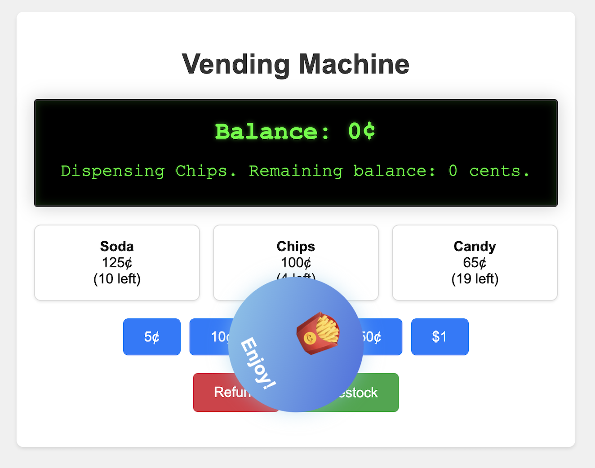
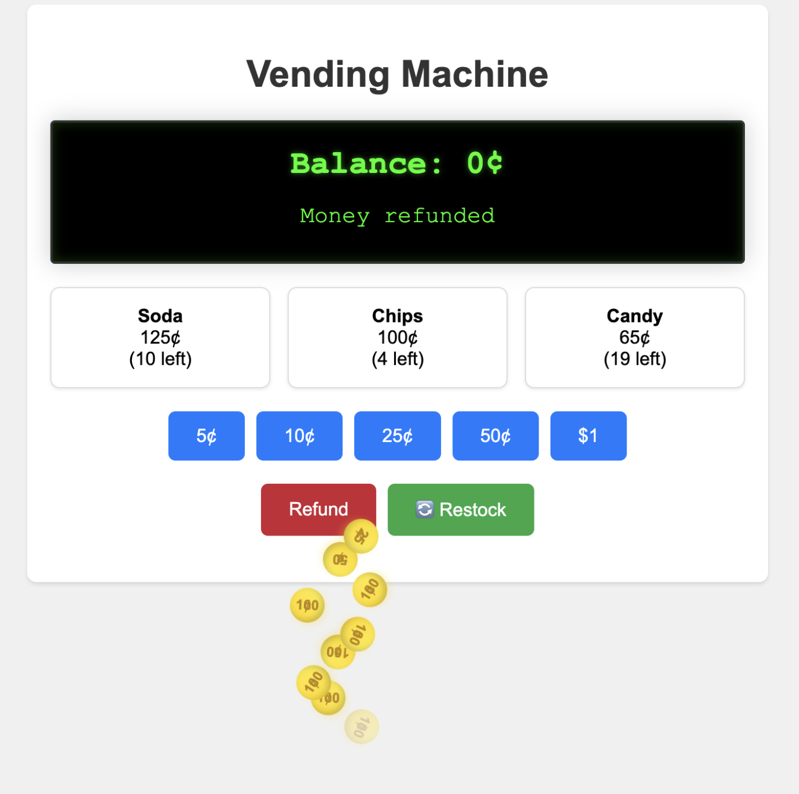
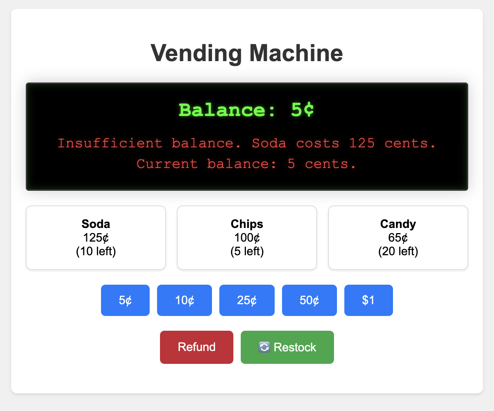

# Vending Machine

A TypeScript implementation of a vending machine that handles product inventory, coin transactions, and change dispensing.

## Author

**ShAI Bernard Lelchuk**
- LinkedIn: [@shaiwhisperer](https://www.linkedin.com/in/shaiwhisperer/)
- Medium: [@shailelchuk](https://medium.com/@shailelchuk)


## Screenshots

### Successful Purchase

*Successful product purchase with animated coin and product dispensing*

### Change Refund

*Refunding change with coin rolling animation*

### Error Handling

*Graceful error handling for insufficient funds or out-of-stock items*

## Features

- Product inventory management
- Coin acceptance (5¢, 10¢, 25¢, 50¢, $1)
- Change calculation and dispensing
- Interactive web interface with animations:
  - 3D coin rolling effects
  - Product-specific emoji animations
  - Restock animations
- Command-line interface
- Error handling for invalid inputs and edge cases

## Prerequisites

- Node.js (v12 or higher)
- TypeScript

## Installation

1. Clone the repository
2. Install dependencies:
```bash
npm install
```

## Usage

### Web Interface
Start the web interface:
```bash
npm run start:ui
```
Then visit http://localhost:3000 in your browser.

### Command Line Interface
Start the CLI version:
```bash
npm start
```

### Available Commands (CLI)

- `display` - Show available products and their prices
- `insert <amount>` - Insert a coin (5, 10, 25, 50, or 100 cents)
- `select <id>` - Select a product by its ID
- `refund` - Return any inserted money
- `exit` - Exit the program

### Example Session (CLI)
```
Welcome to the Vending Machine!
Available products:
A1: Soda - 125 cents (10 left)
B1: Chips - 100 cents (5 left)
C1: Candy - 65 cents (20 left)

> insert 100
Inserted coin: 100 cents. Current balance: 100 cents.

> insert 25
Inserted coin: 25 cents. Current balance: 125 cents.

> select A1
Dispensing Soda. Remaining balance: 0 cents.

> exit
```

## Credits
Created with ❤️ using AI technology:
- [Codebuff](https://codebuff.com) - AI-powered development platform
- [Claude](https://anthropic.com/claude) - AI assistant for code generation and testing

## Version History

You can switch between different versions of the application using Git tags:

### v1.0
Basic CLI implementation:
```bash
git checkout v1.0
npm install
npm start
```

### v1.1
Web UI implementation with basic animations:
```bash
git checkout v1.1
npm install
npm run start:ui
```

### v1.2
Enhanced UI with advanced animations:
```bash
git checkout v1.2
npm install
npm run start:ui
```
- 3D coin rolling animations
- Product-specific emoji animations
- Restock functionality with animations
- Improved state management
- Centered animations and better timing

After checking out any version, remember to run `npm install` to ensure all dependencies are correctly installed for that version.

## License

This project is licensed under the MIT License - see the LICENSE file for details.
